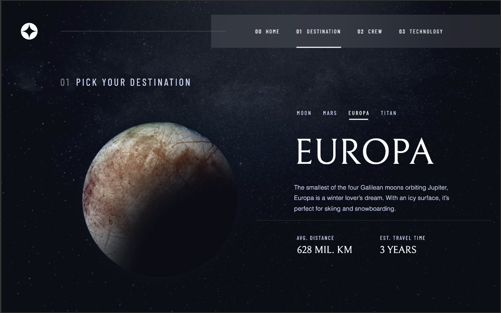
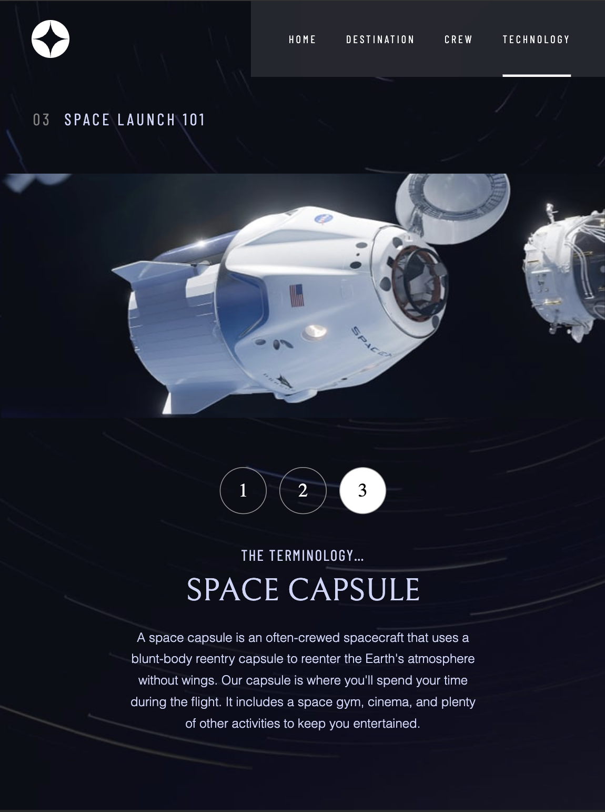
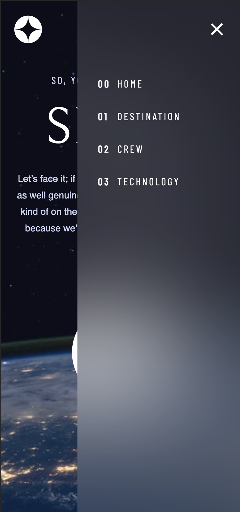

# Frontend Mentor - Space Tourism 
### This is application created using:
* vite,
* react-library, 
* react-router-dom, 
* framer-motion,
* styled-componentsm
* type-script
# [Visit Space-Tourism app](https://chrysidoidea.github.io/Space-Tourism/) 

# Desktop

# Tablet

# Mobile

[Frontend Mentor](https://www.frontendmentor.io) challenges help you improve your coding skills by building realistic projects.